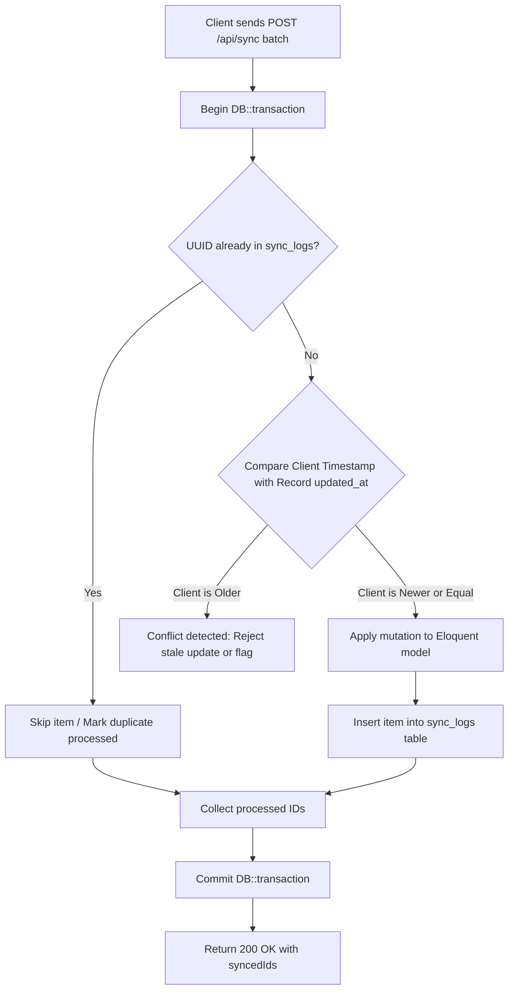

# 🛡️ OMNIDASH × COREERP (LARAVEL) TECHNICAL HANDOFF & INTEGRATION MANIFEST

> **Target Audience:** Laravel Backend Engineering Team (CoreERP)  
> **Frontend Architecture:** React 19 + TypeScript + Tailwind CSS (Vite PWA, Offline-First)  
> **Repository Pattern Service:** `src/services/api.ts` (`DashboardRepository`, `ServerRepository`)  
> **Offline Sync Engine:** Outbox Pattern with IndexedDB (Dexie.js) via `src/hooks/useSyncManager.ts`

---

## I. OmniDash Architecture Overview

OmniDash Enterprise OS is engineered with a **True Offline-First Architecture** delivered as a Progressive Web Application (PWA).

### Architectural Foundations
- **Local-First Persistence (Dexie.js / IndexedDB):** The frontend operates autonomously on-device without requiring continuous internet connectivity. All primary entities—operational metrics, action queues, and staging files—are stored within an IndexedDB database powered by Dexie.js (`src/lib/db.ts`).
- **Repository Pattern Abstraction (`src/services/api.ts`):** Data access is fully decoupled from the UI via the `DashboardRepository` interface. When `VITE_API_MODE=local`, the application binds to `LocalRepository`. When `VITE_API_MODE=server`, OmniDash transparently delegates data operations to `ServerRepository` targeting the Laravel CoreERP backend.
- **Outbox Synchronization Engine (`src/hooks/useSyncManager.ts`):** Write operations are never blocked by network latency or offline status. Every mutation is written immediately to a local `sync_queue` table and dispatched in atomic batches to `/api/sync` once network connectivity is restored.

---

## II. The API Contract (Expected Endpoints)

When `VITE_API_MODE=server`, `ServerRepository` issues standard REST calls using native `fetch()` with `Accept: application/json` and `Content-Type: application/json`. Default base path is `/api` (configurable via `VITE_API_BASE_URL`).

### 1. Data Entries (`/api/entries`)
- **`GET /api/entries`**
  - **Purpose:** Hydrates the dashboard with active operational records.
  - **Query Params (Optional):** `?category=sales|employees|contracts|tasks|inventory|expenses`
  - **Response (`200 OK`):**
    ```json
    [
      {
        "id": "entry_01h8x9abc",
        "category": "sales",
        "sourceName": "Q3_Revenue.xlsx",
        "ingestedAt": "2026-09-24T10:15:30.000Z",
        "date": "2026-09-20",
        "site": "North Hub",
        "region": "EMEA",
        "orderId": "ORD-9482",
        "customer": "Apex Global Logistics",
        "dealType": "Order",
        "revenue": 145000.50,
        "margin": 0.28,
        "status": "On track"
      }
    ]
    ```
- **`POST /api/entries`**
  - **Purpose:** Bulk inserts or updates data entries (e.g., from file imports or snapshot restoration).
  - **Request Body:** `{ "entries": [ /* DataEntry[] */ ] }`
  - **Response (`201 Created` / `200 OK`):** `{ "success": true, "count": 1250 }`
- **`DELETE /api/entries`**
  - **Purpose:** Truncates all data entries in the active workspace.
  - **Response (`200 OK`):** `{ "success": true, "cleared": true }`

### 2. Action Center & Urgency Queue (`/api/actions`)
- **`GET /api/actions`**
  - **Purpose:** Retrieves all urgent operational action items (*Aktionszentrum*).
  - **Response (`200 OK`):** Array of `ActionQueueRecord` objects.
- **`POST /api/actions/sync`**
  - **Purpose:** Recalculates and persists operational queue items from active dataset.
  - **Request Body:** `{ "entries": [ /* DataEntry[] */ ] }`
  - **Response (`200 OK`):** `{ "success": true }`
- **`POST /api/actions/{actionId}/resolve`**
  - **Purpose:** Resolves an action item and updates any linked entity.
  - **Request Body:** `{ "entryId": "entry_01h8x...", "entryHint": { "status": "On track" } }`
  - **Response (`200 OK`):** `{ "resolved": true, "actionId": "act_01h8x..." }`
- **`POST /api/actions/{actionId}/snooze`**
  - **Purpose:** Postpones an action item by 24 hours.
  - **Request Body:** `{}`
  - **Response (`200 OK`):** `{ "snoozed": true }`

### 3. Smart Staging Pipeline (`/api/staging`)
- **`GET /api/staging`**
  - **Purpose:** Lists quarantined files awaiting confidence validation and review.
  - **Response (`200 OK`):** Array of `StagingEntry` objects.
- **`POST /api/staging`**
  - **Purpose:** Adds an unverified ingestion payload into the quarantine queue.
  - **Request Body:** `StagingEntry` object.
  - **Response (`201 Created`):** `{ "id": "stg_99a8b..." }`
- **`POST /api/staging/{id}/approve`**
  - **Purpose:** Approves a quarantined file and merges its records into active operational tables.
  - **Request Body:** `{ "category": "expenses" }` *(optional category override)*
  - **Response (`200 OK`):** `{ "approved": true, "mergedCount": 35 }`
- **`POST /api/staging/{id}/reject`**
  - **Purpose:** Discards a quarantined ingestion item.
  - **Response (`200 OK`):** `{ "rejected": true }`

### 4. Outbox Sync Gateway (`POST /api/sync`)
- **`POST /api/sync`**
  - **Purpose:** Receives batches of queued offline mutations.
  - **Request Body:**
    ```json
    {
      "batch": [
        {
          "id": "sync_c1d2e3f4-...",
          "actionType": "SAVE_ENTRIES | RESOLVE_ACTION | SNOOZE_ACTION | CLEAR_ENTRIES | APPROVE_STAGING_ITEM",
          "entityId": "act_01h8x9...",
          "payload": { /* Mutation details */ },
          "timestamp": "2026-09-24T12:00:00.000Z",
          "status": "pending"
        }
      ]
    }
    ```
  - **Response (`200 OK`):** `{ "success": true, "syncedIds": ["sync_c1d2e3f4-..."] }`

### 5. Settings, Widgets & Backups
| Method | Endpoint | Description | Expected Payload / Response |
| :--- | :--- | :--- | :--- |
| `GET` | `/api/settings` | Retrieve user preferences | Key-value JSON dictionary |
| `POST` | `/api/settings` | Save preferences | Key-value JSON dictionary |
| `GET` | `/api/widgets` | Retrieve widget visibility and layout | `WidgetSetting[]` |
| `POST` | `/api/widgets` | Persist widget layout | `WidgetSetting[]` |
| `GET` | `/api/snapshot` | Export full system snapshot | `SnapshotData` JSON object |
| `POST` | `/api/demo/seed` | Seed default 1,250 records | `{ "count": 1250 }` |

---

## III. Data Typings & Eloquent Models

The Laravel Backend Team should mirror these TypeScript structures in their Eloquent Models and Migrations.

### 1. Primary TypeScript Interfaces

```typescript
export type DataCategory =
  | "sales"
  | "employees"
  | "contracts"
  | "tasks"
  | "inventory"
  | "expenses";

export interface DataEntry {
  id: string;
  category: DataCategory;
  sourceName: string;
  ingestedAt: string;
  date?: string;
  site?: string;
  region?: string;
  // Sales
  orderId?: string;
  customer?: string;
  dealType?: "Order" | "Quote" | "Renewal" | string;
  revenue?: number;
  margin?: number;
  status?: "At risk" | "On track" | string;
  // Employees
  employeeId?: string;
  department?: string;
  role?: string;
  tenureMonths?: number;
  // Inventory
  sku?: string;
  units?: number;
  fillRate?: number;
  shipmentStatus?: "Delayed" | "In transit" | "Delivered" | string;
  // Tasks
  taskId?: string;
  queue?: string;
  sla?: number;
  priority?: "High" | "Standard" | "Low" | string;
  resolved?: boolean;
  // Expenses
  invoiceId?: string;
  vendor?: string;
  amount?: number;
  approved?: boolean;
  // Contracts
  contractId?: string;
  renewalDate?: string;
  value?: number;
  health?: "Watch" | "Healthy" | string;
  [key: string]: unknown;
}

export interface ActionQueueRecord {
  id: string;
  kind: "email" | "invoice" | "stock";
  priority: "critical" | "high" | "medium";
  title: string;
  subtitle: string;
  due: string;
  body: string;
  meta: [string, string][];
  entryId?: string;
  entryHint?: Record<string, unknown>;
  owner: string;
  created: string;
  resolved: boolean;
  snoozedAt?: string | null;
  resolvedAt?: string | null;
}
```

### 2. Laravel Eloquent Models & Migrations

#### Eloquent Model: `DataEntry.php`
```php
namespace App\Models;

use Illuminate\Database\Eloquent\Model;
use Illuminate\Database\Eloquent\Concerns\HasUuids;

class DataEntry extends Model
{
    use HasUuids;

    protected $table = 'data_entries';
    public $incrementing = false;
    protected $keyType = 'string';

    protected $fillable = [
        'id', 'category', 'source_name', 'ingested_at', 'date', 'site', 'region',
        'order_id', 'customer', 'deal_type', 'revenue', 'margin', 'status',
        'employee_id', 'department', 'role', 'tenure_months',
        'sku', 'units', 'fill_rate', 'shipment_status',
        'task_id', 'queue', 'sla', 'priority', 'resolved',
        'invoice_id', 'vendor', 'amount', 'approved',
        'contract_id', 'renewal_date', 'value', 'health',
        'extra_attributes',
    ];

    protected $casts = [
        'ingested_at' => 'datetime',
        'date' => 'date',
        'renewal_date' => 'date',
        'revenue' => 'decimal:2',
        'margin' => 'decimal:4',
        'fill_rate' => 'decimal:4',
        'sla' => 'decimal:4',
        'amount' => 'decimal:2',
        'value' => 'decimal:2',
        'resolved' => 'boolean',
        'approved' => 'boolean',
        'extra_attributes' => 'array',
    ];
}
```

#### Eloquent Model: `ActionQueueRecord.php`
```php
namespace App\Models;

use Illuminate\Database\Eloquent\Model;
use Illuminate\Database\Eloquent\Concerns\HasUuids;

class ActionQueueRecord extends Model
{
    use HasUuids;

    protected $table = 'action_queue_records';
    public $incrementing = false;
    protected $keyType = 'string';

    protected $fillable = [
        'id', 'kind', 'priority', 'title', 'subtitle', 'due', 'body',
        'meta', 'entry_id', 'entry_hint', 'owner', 'created_relative',
        'resolved', 'snoozed_at', 'resolved_at',
    ];

    protected $casts = [
        'meta' => 'array',
        'entry_hint' => 'array',
        'resolved' => 'boolean',
        'snoozed_at' => 'datetime',
        'resolved_at' => 'datetime',
    ];
}
```

---

## IV. The Outbox Pattern (Conflict Resolution)

OmniDash buffers user actions during connectivity drops. When the browser regains internet access, it flushes the outbox in batches to `POST /api/sync`.

### 1. Batch Payload Structure
Each item in `batch` conforms to `SyncQueueRecord`:
- `id` (string, UUIDv4): Unique identifier generated on the client.
- `actionType` (string): Identifies the mutation (`SAVE_ENTRIES`, `RESOLVE_ACTION`, `SNOOZE_ACTION`, `CLEAR_ENTRIES`, `APPROVE_STAGING_ITEM`).
- `entityId` (string | null): Target identifier of the affected record.
- `payload` (JSON): Mutation data payload.
- `timestamp` (ISO-8601 string): Exact client timestamp when the mutation was issued.

### 2. Conflict Resolution Guidelines for Laravel



1. **Strict Idempotency:** The backend must track processed UUIDs in a dedicated `sync_logs` table. If a batch is retransmitted due to a dropped HTTP connection, duplicate mutations are safely skipped.
2. **Timestamp-Based Last-Write-Wins (LWW):** Compare the client mutation's `timestamp` against the entity's `updated_at` on the server:
   - If the server version has an `updated_at` newer than the client `timestamp`, the server mutation occurred after the offline edit. Keep server truth or apply fine-grained attribute merging.
   - If the client `timestamp` is newer or equal, apply the client's payload.
3. **Atomic Execution:** Always encapsulate the batch loop inside a `DB::transaction(...)`. If an unrecoverable database error occurs, rolling back ensures that the client will retry the entire batch on the next cycle.

---

## V. Local Deployment & Laravel Sail

### Option 1: Serving Statically from Laravel `public/` (Single-File Mode)
OmniDash is built with `vite-plugin-singlefile`, creating a self-contained production bundle (`dist/index.html`).

1. **Build the production asset:**
   ```bash
   cd DashGenerator
   npm run build
   ```
2. **Deploy into Laravel:**
   Copy `dist/index.html` to `resources/views/dashboard.blade.php` or `public/dashboard/index.html`.
3. **Serve via Route (`routes/web.php`):**
   ```php
   Route::get('/dashboard', function () {
       return file_get_contents(public_path('dashboard/index.html'));
   });
   ```

### Option 2: Running Development Server Alongside Laravel Sail

1. **Configure OmniDash Environment:**
   Create `.env.development.local` in `DashGenerator/`:
   ```ini
   VITE_API_MODE=server
   VITE_API_BASE_URL=http://localhost/api
   ```

2. **Configure CORS in Laravel (`config/cors.php`):**
   ```php
   return [
       'paths' => ['api/*', 'sanctum/csrf-cookie'],
       'allowed_methods' => ['*'],
       'allowed_origins' => ['http://localhost:5173', 'http://127.0.0.1:5173'],
       'allowed_headers' => ['*'],
       'supports_credentials' => true,
   ];
   ```

3. **Vite Proxy Option (`vite.config.ts`):**
   Alternatively, you can proxy all `/api` requests directly to Laravel Sail (port 80) to avoid CORS altogether:
   ```typescript
   export default defineConfig({
     server: {
       proxy: {
         '/api': {
           target: 'http://localhost:80',
           changeOrigin: true,
           secure: false,
         },
       },
     },
   });
   ```
